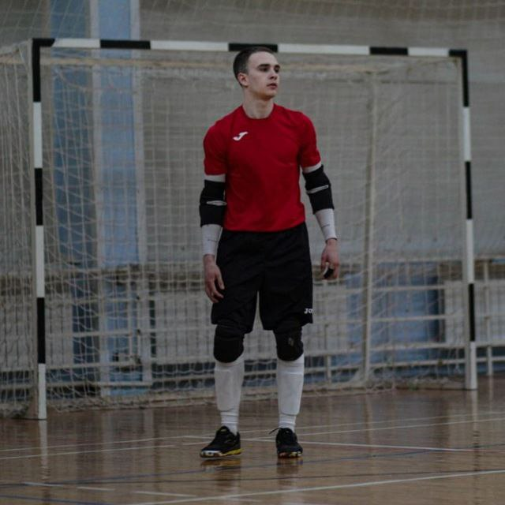

# 🏆 Биография Вадима — стража ворот и хранителя духа игры

![Вратарь на позиции]

---

## 🧤 Основная информация

- **Имя:** Вадим
- **Позиция:** Вратарь
- **Рост:** 172 см
- **Вес:** 63 кг
- **Дата рождения:** 1 июля 2004
- **Гражданство:** Российская Федерация
- **Текущий клуб:** В поиске 
- **Номер:** 32

---

## 🌐 Связь

- 🐦 Telegram: https://t.me/goalkeeper_32k

---

> *"Уважай соперника"* 